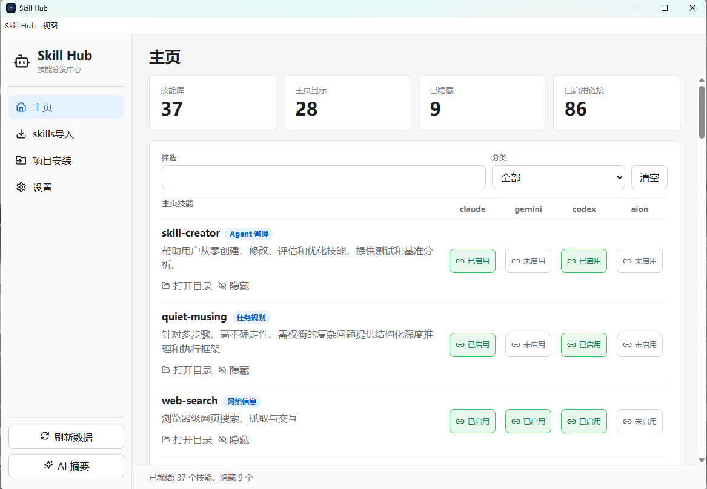
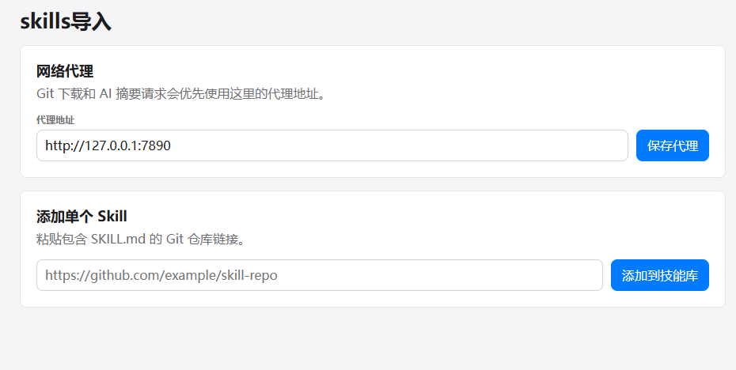
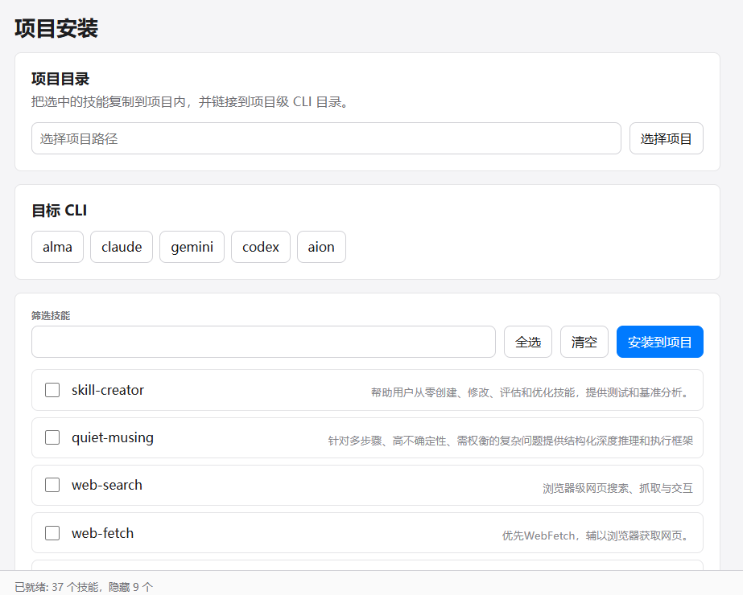
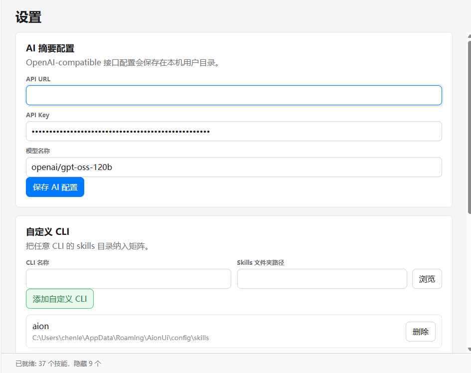
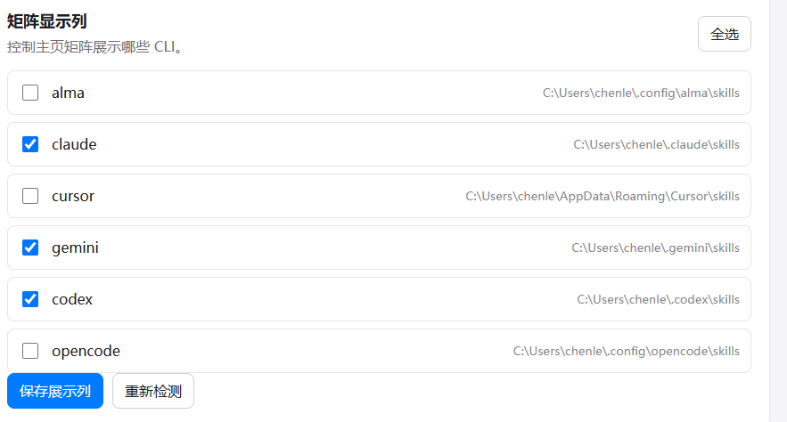

# Skill Hub

> 跨 CLI 的 AI Agent 技能分发中心 — 一处管理，多端启用。

Skill Hub 是一个基于 Electron + React + Vite 构建的桌面应用，用于集中管理散落在不同 AI CLI（Claude、Gemini、Codex、Cursor、Alma、OpenCode 等）下的 `skills` 目录，并以矩阵视图直观查看 / 切换每个技能在各个 CLI 下的启用状态。

## 功能特性

- **技能矩阵主页**：以「技能 × CLI」表格形式集中展示所有 skills，逐格切换启用 / 未启用
- **多 CLI 适配**：内置 claude / gemini / codex / cursor / alma / opencode，支持自定义任意 CLI 的 skills 路径
- **Skills 一键导入**：粘贴 GitHub 仓库链接即可拉取 `SKILL.md`，并入本机技能库
- **项目级安装**：把选中的技能复制到指定项目目录，并链接到项目级 CLI 目录
- **AI 摘要**：通过 OpenAI 兼容接口为技能自动生成中文摘要，便于检索与浏览
- **网络代理**：Git 拉取与 AI 摘要请求统一走自定义代理，便于离线 / 国内网络环境

## 截图

### 主页 — 技能矩阵



左侧为技能列表与分类筛选，右侧矩阵列出每个 CLI 对该技能的启用状态。顶部统计卡片实时显示技能库总数、主页显示数、已隐藏数与已启用链接数。

### Skills 导入



支持配置网络代理；粘贴包含 `SKILL.md` 的 Git 仓库链接即可一键加入技能库。

### 项目安装



选择项目路径与目标 CLI（可多选），勾选要安装的技能，一键复制并建立项目级链接。

### 设置 — AI 摘要与自定义 CLI



配置 OpenAI 兼容接口（API URL / Key / 模型名）；也可把任意 CLI 的 skills 文件夹纳入矩阵。

### 设置 — 矩阵显示列



按需勾选要在主页矩阵中显示的 CLI 列，未勾选的 CLI 会从主页矩阵中隐藏（但其 skills 目录仍会被检测）。

## 安装与运行

### 环境要求

- Node.js 20+
- Windows 10/11（当前 `electron-builder` 配置仅打包 Windows 目标，其他平台需自行调整）

### 开发模式

```bash
npm install
npm run dev:full
```

`dev:full` 会先编译主进程 TypeScript，然后并行启动 Vite 渲染端与 Electron 主进程。

### 构建可执行文件

```bash
# NSIS 安装包
npm run package:win:installer

# 便携版 EXE
npm run package:win
```

产物输出到 `release/` 目录。

## 目录结构

```
skill-hub/
├─ src/
│  ├─ main/          # Electron 主进程：IPC、数据库、菜单、更新
│  ├─ preload/       # 预加载脚本
│  ├─ renderer/      # React 渲染端：页面、组件、状态、服务
│  └─ shared/        # 主进程与渲染端共享的类型与常量
├─ resources/        # 打包时附带的资源（如默认远端摘要）
├─ buildResources/   # 应用图标等构建资源
├─ docs/images/      # README 截图
└─ package.json
```

## 技术栈

- Electron 36
- React 19 + TypeScript 5.7
- Vite 6
- lucide-react（图标）
- undici（HTTP 客户端，配合代理）

## 许可

本仓库当前未指定开源许可证；如需复用请先与作者联系。
